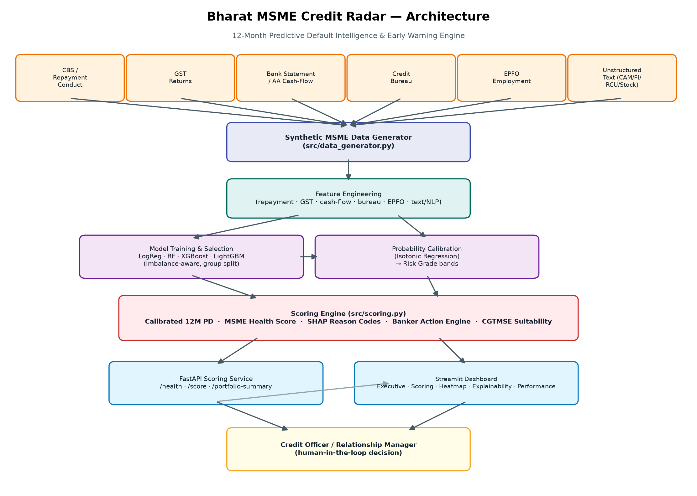

# Bharat MSME Credit Radar

### A 12-Month Predictive Default Intelligence and Early Warning Engine for Indian MSME Loans

**Hackathon:** IDBI Innovate 2026 — **Track 04: MSME Credit | Predictive AI | Risk Management**

> ⚠️ **Disclaimer:** This prototype uses synthetic MSME data for hackathon
> demonstration. No production lending decision should be made using this model without
> validation on historical bank data, governance approval, calibration, fairness
> testing, drift monitoring and human-in-the-loop controls.

---

## 1. Problem Statement

MSME credit risk assessment in Indian banks is largely **fragmented and document-heavy**:
GST returns, bank statements, bureau reports, EPFO filings, and field-visit remarks are
each reviewed in silos, usually only at loan origination or annual renewal. By the time
an account shows textbook stress (90+ DPD, SMA-2), the window for early, low-cost
intervention (a field visit, a stock audit, a limit freeze) has often already closed.
Banks need a way to continuously fuse these signals into a forward-looking, explainable
early-warning score — not a static appraisal snapshot.

## 2. Solution Overview

**Bharat MSME Credit Radar** is an end-to-end prototype that converts structured,
alternate, and unstructured MSME credit signals into:

1. **12-month Probability of Default (PD)** — calibrated, per borrower
2. **MSME Health Score (0–100)** — a weighted, interpretable composite score
3. **Early Warning Grade** — Green / Yellow / Amber / Red / Black
4. **SHAP-based reason codes** — top risk and strength drivers, banker-readable
5. **Banker action recommendation** — rule-based, tied to grade + top drivers
6. **Borrower output card** — a single-borrower decision-support view
7. **Portfolio heatmap dashboard** — sector × geography risk radar with action queues

The prototype is built on **synthetic but domain-realistic data** (see Section 8) and
ships a working synthetic data generator, feature engineering pipeline, model
comparison/training/calibration pipeline, SHAP explainability, a rule-based action
engine, a FastAPI scoring service, and a 5-page Streamlit dashboard.

## 3. Architecture



Six synthetic data rails (repayment/CBS, GST, bank statement/AA cash-flow, bureau, EPFO,
unstructured text) feed a feature engineering pipeline, which feeds a model
comparison/selection step, isotonic probability calibration, and a scoring engine that
produces PD, Health Score, SHAP reason codes and a banker action recommendation. This is
exposed both via a FastAPI service and a Streamlit dashboard, in front of a
human-in-the-loop credit officer.

## 4. Features

- Synthetic borrower-month dataset generator (28,000 rows / 3,500 borrowers / 8 months)
  spanning borrower profile, repayment conduct, GST, bank/AA cash-flow, bureau, EPFO and
  free-text remarks, with a realistic ~6.5% 12-month stress rate.
- Feature engineering across 6 feature families (repayment, GST authenticity, cash-flow,
  bureau, EPFO, text/NLP) — 87 model-ready features.
- Model comparison: Logistic Regression, Random Forest, XGBoost, LightGBM, with
  imbalance-aware training, a **borrower-grouped** train/calibration/test split (no
  borrower's months leak across splits), and threshold tuning.
- Evaluation beyond accuracy: AUC-ROC, AUC-PR, Gini, KS, recall@10%/20%, top-decile lift,
  Brier score, confusion matrix.
- Isotonic probability calibration → PD → 5-band risk grade.
- 0–100 MSME Health Score with a documented, weighted sub-score breakdown.
- SHAP explainability with a curated banker reason-code dictionary (GST-FIL-DLY,
  CC-UTIL-HI, EMI-BOUNCE, BUY-CONC-HI, RCU-RED-FLAG, DP-EROSION, …).
- Rule-based banker action engine, including a dedicated CGTMSE suitability recommendation.
- FastAPI service: `/health`, `/score`, `/portfolio-summary`.
- Streamlit dashboard: Executive Dashboard, Borrower Scoring, Portfolio Heatmap,
  Explainability, Model Performance.

## 5. Tech Stack

| Layer | Technology |
|---|---|
| Data generation & feature engineering | Python, pandas, numpy |
| Modelling | scikit-learn, XGBoost, LightGBM |
| Calibration | scikit-learn `CalibratedClassifierCV` (isotonic) |
| Explainability | SHAP |
| Text / NLP | scikit-learn TF-IDF + Logistic Regression, keyword rules |
| API | FastAPI, Pydantic, uvicorn |
| Dashboard | Streamlit, Plotly |
| Notebooks | Jupyter |

## 6. Dataset Explanation

`data/synthetic_msme_data.csv` — 28,000 borrower-month rows for 3,500 synthetic MSME
borrowers across 8 sectors (Textile, Engineering, Chemicals, Food Processing, Gems &
Jewellery, Services, Retail, Construction) and 9 geographies (Surat, Rajkot, Vadodara,
Ahmedabad, Mumbai, Pune, Jaipur, Ludhiana, Coimbatore).

Each row is generated around a hidden per-borrower **latent risk propensity** so that
repayment conduct, GST compliance, cash-flow strength, bureau discipline, EPFO
employment trends and free-text remarks are all internally consistent for a given
borrower — a deteriorating borrower shows correlated stress across every data rail, not
independently-random noise. The binary target `stress_12m` (~6.5% prevalence) is built
from a logistic combination of the realized (noisy) observable signals plus a sizeable
independent shock term, and its intercept is calibrated by bisection to land in the
5–8% prevalence band requested by the brief. See `reports/prototype_validation_note.md`
for a full, honest discussion of what this synthetic design does and does not represent.

Also included: `data/sample_score_payload.json` (a full example `/score` request body)
and `reports/sample_borrower_output_card.md` (the corresponding scored output).

## 7. How to Run Locally

Requires Python 3.10+. Works on Windows, macOS and Linux — no hardcoded paths.

```bash
git clone <this-repo>
cd bharat-msme-credit-radar
python -m venv .venv
source .venv/bin/activate        # Windows: .venv\Scripts\activate
pip install -r requirements.txt
```

### 7.1 Regenerate the data and model artifacts (optional — pre-built artifacts are already committed)

```bash
python src/data_generator.py --n-borrowers 3500 --months 8 --out data/synthetic_msme_data.csv
python src/train_model.py
python src/evaluate_model.py
```

This (re)creates `data/synthetic_msme_data.csv` and, in `models/`: `trained_model.pkl`,
`calibrator.pkl`, `feature_list.json`, `tfidf_vectorizer.pkl`, `text_risk_model.pkl`,
`default_profile.json`, `training_report.json`, `evaluation_report.json`, and refreshes
`reports/model_performance_report.md`.

### 7.2 Run the FastAPI scoring service

```bash
uvicorn api.main:app --reload --port 8000
```

Interactive docs: `http://localhost:8000/docs`

### 7.3 Run the Streamlit dashboard

```bash
streamlit run app/streamlit_app.py
```

Opens at `http://localhost:8501`.

### 7.4 Explore the notebooks

```bash
jupyter notebook notebooks/
```

`01_generate_synthetic_data.ipynb` → `02_feature_engineering.ipynb` →
`03_model_training_evaluation.ipynb` → `04_shap_explainability.ipynb`. All four are
pre-executed with saved outputs so they can be read without re-running.

## 8. API Usage

### `GET /health`

```json
{"status": "ok", "service": "Bharat MSME Credit Radar API"}
```

### `POST /score`

Only `borrower_id` is required — every other field is optional. Unset fields are
imputed from the training population's typical (median/mode) values; the response's
`data_quality_score` tells you how much of the score rests on data you actually
supplied vs. population defaults. See `data/sample_score_payload.json` for a full
example request body (a real synthetic borrower, `B100282`).

```bash
curl -X POST http://localhost:8000/score \
  -H "Content-Type: application/json" \
  -d @data/sample_score_payload.json
```

Minimal example request:

```json
{
  "borrower_id": "B000123",
  "segment": "Manufacturer",
  "loan_type": "Cash Credit",
  "gst_turnover_growth_yoy": -12.5,
  "gst_filing_delay_count_6m": 3,
  "gstr1_vs_3b_mismatch_pct": 18.2,
  "bank_credit_to_gst_sales_ratio": 0.62,
  "cc_utilization_avg_3m": 94.5,
  "emi_bounce_count_6m": 2,
  "bureau_score": 682,
  "bureau_enquiry_count_3m": 5,
  "buyer_concentration_top2_pct": 61,
  "epfo_employee_count_change_6m": -18,
  "cam_remarks": "cash flow stress visible and buyer concentration high"
}
```

Response shape:

```json
{
  "borrower_id": "B100282",
  "pd_12m": 0.125,
  "risk_grade": "Amber",
  "health_score": 44.8,
  "health_band": "Weak",
  "data_quality_score": 100,
  "top_risk_drivers": [
    {"code": "REPAY-STRESS", "description": "High composite repayment stress index", "impact": 0.0439}
  ],
  "top_strength_drivers": [
    {"code": "BUR-DPD-CLEAN", "description": "Clean bureau DPD history", "impact": -0.0253}
  ],
  "recommended_action": "Amber Watch: conduct field visit within 30 days, given declining employee headcount.",
  "action_checklist": ["Conduct field visit within 30 days.", "..."],
  "cgtmse_recommendation": null,
  "model_version": "random_forest"
}
```

Full worked example: `reports/sample_borrower_output_card.md`.

### `GET /portfolio-summary`

Returns total accounts, total exposure, counts and exposure by risk grade, expected
12-month stress amount, average PD/health score, the top-10 highest-risk accounts, and
sector-wise / geography-wise risk summaries.

## 9. Streamlit Dashboard Usage

Launch with `streamlit run app/streamlit_app.py` and use the sidebar to navigate:

1. **Executive Dashboard** — portfolio KPIs, risk-grade distribution, PD histogram,
   sector/geography expected-stress charts.
2. **Borrower Scoring** — pick an existing borrower or enter details manually; view the
   full borrower output card (PD, grade, health score, drivers, recommended action).
3. **Portfolio Heatmap** — sector × geography PD heatmap, high-risk borrower table, and
   action queues (field visit / stock audit / GST-bank mismatch / high CC utilization /
   negative text remarks).
4. **Explainability** — SHAP driver bar chart and reason-code table for any borrower,
   plus calibration and data-quality notes.
5. **Model Performance** — AUC-ROC, AUC-PR, KS, Gini, recall@20%, lift, confusion
   matrix, and calibration curve.

## 10. Model Performance Summary

| Metric (held-out, borrower-grouped test set) | Value |
|---|---|
| AUC-ROC | 0.946 |
| AUC-PR | 0.715 |
| Gini | 0.892 |
| KS Statistic | 0.764 |
| Recall @ top 20% risk band | 90.7% |
| Recall @ top 10% risk band | 77.9% |
| Top-decile lift | 7.79x |
| Brier Score (calibrated) | 0.0299 |

Selected model: **Random Forest**, isotonic-calibrated. Full breakdown, the model
comparison table, confusion matrix and calibration curve are in
`reports/model_performance_report.md`. **These figures are computed on synthetic data
and validate the pipeline's design logic — they are not a claim of real-world,
bank-grade predictive performance.** See Section 13 caveats below.

## 11. Explainability Approach

Every score carries SHAP (`TreeExplainer`) attributions from the underlying tree model.
Raw SHAP contributions are mapped through a curated dictionary
(`src/explainability.py::FEATURE_META`) into standardised, banker-readable reason codes
(e.g. `GST-FIL-DLY`, `CC-UTIL-HI`, `EMI-BOUNCE`, `BUY-CONC-HI`, `BUR-ENQ-SPIKE`,
`EPFO-DECLINE`, `TXT-STRESS`, `RCU-RED-FLAG`, `DP-EROSION`, `CASH-VOL-HI`, `ITC-RISK`),
with the top 5 risk drivers and top 5 strength drivers surfaced per borrower. The
probability itself is calibrated (isotonic regression), while SHAP explains the
underlying tree model's ranking of drivers — both are always reported together with a
calibration note in the API response and the Explainability dashboard page.

## 12. Governance Note

- AI **assists** credit officers; it does not replace them.
- No automatic rejection, sanction, or restructuring decision solely on an AI score.
- Consent-based, DPDP-aligned use of borrower data.
- Explainability (reason codes) is generated for **every** score, not just flagged ones.
- Every score is tagged with a model version for audit trail purposes.
- Periodic model validation, segment-wise bias/fairness checks, and drift monitoring are
  required before production use (not implemented in this prototype).
- A challenger-model framework should benchmark any production model on an ongoing basis.
- Secure API access control (auth, rate limiting, audit logging) is required before any
  real deployment — this open prototype has none.

Full governance and limitations discussion: `reports/prototype_validation_note.md`.

## 13. Limitations

This is a **hackathon design-logic prototype**, not a validated credit model:

- All data is synthetic; no real bureau, GST, AA, CBS or EPFO data was used.
- No out-of-time / multi-cycle validation, no fairness testing, no drift monitoring.
- Text remarks are template-sampled, not genuine officer free text.
- Health-score weights and risk-grade/PD bands follow the brief's illustrative design,
  not a bank's back-tested policy.
- The FastAPI service has no authentication — add access control before any real use.

See `reports/prototype_validation_note.md` for the full, honest breakdown and next
steps for real bank-data validation.

## 14. Future Roadmap

- Validate feature engineering and model pipeline against a historical, de-identified
  bank loan book with a genuine forward-looking stress definition.
- Add out-of-time validation across multiple economic cycles/vintages.
- Segment-wise and protected-attribute fairness/bias testing.
- Replace the keyword/TF-IDF text model with a fine-tuned domain language model.
- Add authentication, rate limiting and audit logging to the API.
- Build drift-monitoring dashboards on both feature distributions and calibration.
- Introduce a champion/challenger model framework with automated retraining triggers.
- Integrate directly with real GST/AA/Bureau/EPFO data providers under proper consent
  and data-sharing agreements.

## 15. Repository Structure

```text
bharat-msme-credit-radar/
├── README.md
├── requirements.txt
├── .gitignore
├── data/
│   ├── synthetic_msme_data.csv
│   └── sample_score_payload.json
├── notebooks/
│   ├── 01_generate_synthetic_data.ipynb
│   ├── 02_feature_engineering.ipynb
│   ├── 03_model_training_evaluation.ipynb
│   └── 04_shap_explainability.ipynb
├── src/
│   ├── data_generator.py
│   ├── feature_engineering.py
│   ├── train_model.py
│   ├── evaluate_model.py
│   ├── explainability.py
│   ├── scoring.py
│   └── action_engine.py
├── api/
│   ├── main.py
│   └── schemas.py
├── app/
│   └── streamlit_app.py
├── models/
│   ├── trained_model.pkl
│   ├── calibrator.pkl
│   ├── feature_list.json
│   └── ... (tfidf_vectorizer.pkl, text_risk_model.pkl, default_profile.json,
│            training_report.json, evaluation_report.json — supporting artifacts)
├── reports/
│   ├── model_performance_report.md
│   ├── prototype_validation_note.md
│   ├── sample_borrower_output_card.md
│   └── demo_script.md
└── assets/
    ├── architecture_diagram.png
    └── dashboard_screenshot.png
```

## 16. Demo Flow

See `reports/demo_script.md` for the full 3-minute walkthrough (problem & data → score a
borrower → portfolio radar), built around real outputs from this repo's trained model.

> "Bharat MSME Credit Radar transforms MSME lending from static appraisal to living
> credit intelligence."
